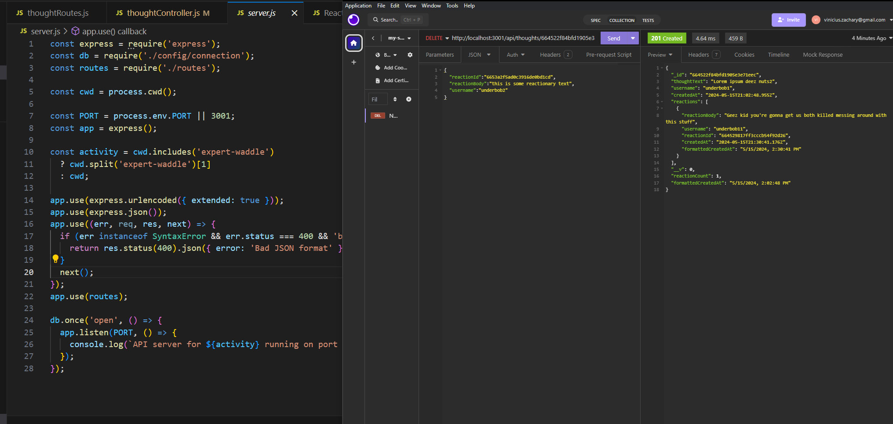

# Social Media API

Welcome to the Social Media API! This API manages an imaginary social media front-end and allows interaction with thoughts and user data. It's built with Node.js, Express, and MongoDB.

## Table of Contents

- [Introduction](#introduction)
- [Technologies](#technologies)
- [Installation](#installation)
- [Usage](#usage)
- [API Endpoints](#api-endpoints)
- [Models](#models)
- [Contributing](#contributing)
- [License](#license)

## Introduction

This API serves as a backend system for a social media application. It provides endpoints for handling thoughts, users, and their relationships, as well as CRUD operations and reactions associated with thoughts.

## Technologies

- Node.js
- Express.js
- MongoDB
- Mongoose

## Installation

To run this project locally, follow these steps:

1. **Clone the repository:**

   ```bash
   git clone <repository-url>
   cd <project-folder>
   ```

2. **Install dependencies:**

   ```bash
   npm install
   ```

3. **Start the server:**

   ```bash
   npm start
   ```

   The API server will start running locally on `http://localhost:3001`.

## Usage

Once the server is running, you can use a tool like Insomnia to interact with the API endpoints. Here are some of the available endpoints:

## API Endpoints

### Thoughts

- `GET /api/thoughts`: Get all thoughts
- `POST /api/thoughts`: Create a new thought
- `GET /api/thoughts/:thoughtId`: Get a single thought by ID
- `PUT /api/thoughts/:thoughtId`: Update a thought by ID
- `DELETE /api/thoughts/:thoughtId`: Delete a thought by ID
- `POST /api/thoughts/:thoughtId/reactions`: Add a reaction to a thought
- `DELETE /api/thoughts/:thoughtId/reactions`: Remove a reaction from a thought

### Users

- `GET /api/users`: Get all users
- `POST /api/users`: Create a new user
- `GET /api/users/:userId`: Get a single user by ID
- `PUT /api/users/:userId`: Update a user by ID
- `DELETE /api/users/:userId`: Delete a user by ID
- `POST /api/users/:userId/friends/:friendId`: Add a friend to a user
- `DELETE /api/users/:userId/friends/:friendId`: Remove a friend from a user

## Models

### Thought

Represents a thought or idea submitted by a user.

- Fields:
  - `thoughtText`: String, required
  - `username`: String, required
  - `createdAt`: Date, default: Date.now
  - `reactions`: Array of Reaction objects

### User

Represents a user who interacts with the application.

- Fields:
  - `username`: String, required, unique
  - `email`: String, required, unique, must be a valid email
  - `thoughts`: Array of Thought ObjectIds
  - `friends`: Array of User ObjectIds

### Reaction

Represents a reaction or response to a thought.

- Fields:
  - `reactionBody`: String, required
  - `username`: String, required
  - `createdAt`: Date, default: Date.now

## Contributing

Contributions are welcome! Please feel free to submit a pull request or open issues for feature requests, bugs, or questions.

1. Fork the repository.
2. Create your feature branch: `git checkout -b feature/new-feature`.
3. Commit your changes: `git commit -am 'Add new feature'`.
4. Push to the branch: `git push origin feature/new-feature`.
5. Submit a pull request.

## License

This project is licensed under the MIT License

## GitHub Repo and Screenshot

[GitHub Repo](https://github.com/VZachary13/expert-waddle)


